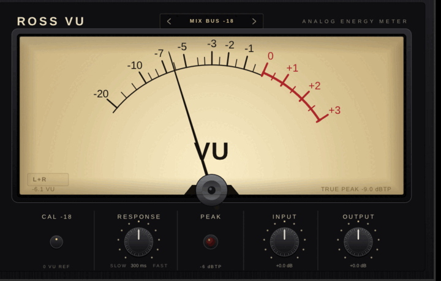

# ROSS VU
### ANALOG ENERGY METER

A needle VU meter for Linux and Windows. VST3, CLAP, LV2 and standalone, from a
single codebase. Built with [DPF](https://github.com/DISTRHO/DPF) and NanoVG.



*Leia em [português](README.pt-BR.md).*

---

## What it actually does

This is not a decorative pointer animated by RMS. The movement is a real
second order system with average rectification, exactly like the
electromechanical instrument:

| measurement | VU standard | ROSS VU (measured) |
|---|---|---|
| time to 99% deflection | 300 ms | 299 to 302 ms |
| overshoot | 1% to 1.5% | 0.86% to 1.00% |
| sine at reference level | 0.00 VU | 0.000 VU |
| tone 6 dB below reference | -6.00 VU | -6.012 VU |

Constants: zeta = 0.826, omega0 = 14 rad/s. Verified at 44.1 kHz, 48 kHz and 96 kHz.

The dial scale is drawn from the linear deflection of the movement,
`p = 10^(VU/20) / 10^(3/20)`, which is what produces the compression on the left
and the spread near zero. It is not a scale invented to look vintage.

Because it is **average rectified** and not RMS, it reads high crest factor
material below RMS, just like an iron vane VU. That is correct behaviour, not a bug.

## True peak

The lamp and the readout are **dBTP**, via 4x polyphase oversampling (12
coefficients per phase, Blackman-Harris windowed sinc, in the spirit of
ITU-R BS.1770-4). The classic case, full scale sine at fs/4 with 45 degree phase:

| | reading |
|---|---|
| sample peak (what almost every meter shows) | -3.01 dBFS |
| ROSS VU | **-0.20 dBTP** |
| true value | 0.00 dB |

Error within the 4x tolerance of BS.1770. A sample peak meter would be 3 dB wrong
on that signal, and that is exactly where the limiter blows up.

## Which calibration to use

`-18 dBFS = 0 VU` is a **tracking and mixing** convention, inherited from analog
`0 VU = +4 dBu`. A finished master does not live there: it sits 4 to 6 dB above,
so it hits the red and pins the needle. That is the right instrument telling the
truth, not a fault.

| what you are looking at | calibration |
|---|---|
| tracking, input gain | -20 or -18 |
| mixing, buses and channels | -18 or -16 |
| finished mix before mastering | -14 |
| commercial master, A/B reference | -12, -10 or -8 |

The same -14 dBFS RMS master reads `+4.0 VU` at CAL -18, `0.0 VU` at CAL -14 and
`-4.0 VU` at CAL -10. Measured, not estimated.

**In REAPER the FX chain is pre fader.** If you pulled down the fader on your
reference track to level match an A/B, the meter still sees the full level, not
what your ears are hearing.

## The peak lamp

A lamp that only lights after you already clipped is useless. Its job is to show
the transient the slow needle hides, so it has to fire **before** the clip. The
threshold is chosen by clicking, in dBTP:

`-12` · `-9` · `-6` · `-3` · `-1` · `-0.1`

Default is **-6 dBTP**. Hold time is deliberately short, **400 ms**, so it reads
as a blink and not as a stuck lamp. Measured: a 30 ms overshoot above threshold
lights it for 430 ms, six overshoots give six blinks, and nothing below the
threshold lights it at all.

## Controls

| control | range | note |
|---|---|---|
| CAL | -20 / -18 / -16 / -14 / -12 / -10 / -8 dBFS | click cycles; defines what 0 VU is |
| RESPONSE | 600 ms to 100 ms | centre gives the normative 300 ms |
| PEAK | -12 / -9 / -6 / -3 / -1 / -0.1 dBTP | click cycles; blinks for 430 ms |
| INPUT | -24 to +24 dB | **changes the audio**, not just the meter |
| OUTPUT | -24 to +24 dB | output gain |
| MODE | L+R / LEFT / RIGHT / SIDE / L \| R | click the label at the bottom left of the dial |

In **L \| R** mode a second pointer appears, thinner and lighter, carrying the
right channel. The left one stays the solid pointer.

Presets and mode live in the interface itself, not buried in the host parameter
list. The `‹ MIX BUS -18 ›` selector in the header steps through the list, and
touching any control switches it to `CUSTOM`. Everything clickable lights up on
hover, so you can find it without a manual.

## Factory presets

| preset | 0 VU | response | mode | lamp |
|---|---|---|---|---|
| MIX BUS -18 | -18 dBFS | 300 ms | L+R | -6 dBTP |
| TRACKING -20 | -20 dBFS | 100 ms | L+R | -12 dBTP |
| MIX READY -14 | -14 dBFS | 300 ms | L+R | -3 dBTP |
| MASTER -10 | -10 dBFS | 300 ms | L+R | -1 dBTP |
| REFERENCE -12 | -12 dBFS | 300 ms | L+R | -1 dBTP |
| STEREO L \| R | -18 dBFS | 300 ms | L \| R | -6 dBTP |
| PROGRAM SLOW | -18 dBFS | 600 ms | L+R | -6 dBTP |

## Install

Prebuilt binaries are on the [releases page](../../releases).

### Linux

```
tar xf ROSS-VU-1.4.1-linux-x86_64.tar.gz
cd ROSS-VU-1.4.1
mkdir -p ~/.vst3 ~/.clap ~/.lv2
cp -r ROSSVU.vst3 ~/.vst3/
cp    ROSSVU.clap ~/.clap/
cp -r ROSSVU.lv2  ~/.lv2/
```

Needs glibc 2.27 or newer: Ubuntu 18.04, Debian 10, Fedora 28 and anything
after. **Version 1.4 needed glibc 2.43** and failed to load on most distros with
`GLIBC_2.43 not found`. 1.4.1 fixes that and changes nothing in the metering.

In REAPER: Options > Preferences > Plug-ins > VST > Re-scan. CLAP in `~/.clap`
is scanned along with it.

### Windows

Unzip and drop `ROSSVU.vst3` and `ROSSVU.clap` into
`C:\Program Files\Common Files\VST3` and `...\CLAP`.

### Build from source

ROSS VU builds against DPF, which sits next to it as a sibling folder. DPF
carries its own submodule (pugl), so it is the DPF clone that needs
`--recursive`, not this repo (this repo has no submodules).

```
git clone https://github.com/RickRossati/ross-vu
git clone --recursive https://github.com/DISTRHO/DPF
cd ross-vu
make            # VST3 + CLAP + LV2 + standalone, into ../bin
./instalar.sh   # or this: builds, then copies into ~/.vst3, ~/.clap, ~/.lv2
```

Known-good DPF commit: `4238e1c` (Sep 2026). DPF's `develop` branch moves; if a
later commit breaks the build, check that one out inside DPF.

A plain `make` links against the glibc of the machine you build on, so the
binary only runs there or on something newer. Release builds for Linux use
`./build-linux-compat.sh`, which compiles inside Ubuntu 20.04 with podman and
generates the LV2 `.ttl` files (a separate step in DPF, easy to forget, and
without them no host finds the LV2). Output in `../bin-compat`.

`make windows` cross compiles with mingw-w64 and produces VST3 + CLAP in
`../bin-win`. The binary is PE32+ x64 and depends on no mingw DLL, only on
Windows' own.

## What is not there yet

- macOS build (the code is portable, the toolchain is missing)
- Validation of the Windows build in a real DAW
- Level history over time
- Fixed step resizing (today it is free, keeping the aspect ratio)

**Honest caveat:** neither the Windows `.exe` nor the `.zip` has been opened in a
DAW on real Windows, because the machine this is built on does not run Windows.
It was verified as a valid PE with the right exports (`GetPluginFactory` for
VST3, `clap_entry` for CLAP). Testing under Wine failed before the plugin even
ran: Wine's `wglChoosePixelFormatARB` returns zero formats and pugl gives up
there. That hits any DPF app under Wine on this machine, it is not a ROSS VU bug.

If you run it on Windows, telling me what happened is genuinely useful.

## How this was verified

Not talk. The tests live in `tests/`, and `tests/rodar.sh` runs all three:

- `vutest2.cpp` extracts the actual `struct Movement` from `RossVUPlugin.cpp` and
  measures rise time, overshoot and rest level at 44.1k, 48k and 96k.
- `tptest.cpp` extracts the real `struct TruePeak` and compares it against the
  analytic peak on six signals, including the fs/4 case.
- `lamptest.cpp` extracts the real `struct PeakLamp` and counts blinks and
  duration across six combinations of overshoot and threshold.
- End to end: a 1 kHz tone generated at -18.01 dBFS RMS, routed straight into the
  plugin's input ports through PipeWire, needle settling at 0.0 VU and true peak
  at -15.0 dBTP.

## License

GPL-3.0-or-later. DPF is ISC. Liberation Sans is OFL.

Built by [Mister RickRoss](https://misterrickross.com), 2026.
